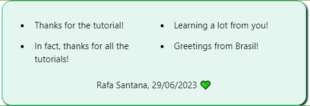

# Tutorial de Git & GitHub

Tutorial do site **W3Schools** que explica bem a diferença entre Git e GitHub e ensina a trabalhar com ambos. 

As explicações são simples e diretas. O tutorial é muito prático.

Todos os comandos que executei aqui (*commits*, *push*, *pull*, etc) foram feitos usando o terminal de comandos, Git Bash.

E o mais legal eles deixaram pro fim. 

A turma do **W3Schools** criou um repositório, o **Guestbook**, no qual você pode fazer um *pull request*. Esse *pull request* pode ser uma simples mensagem de agradecimento, por exemplo. O mais bacana é que eles fizeram uma github-pages deste projeto e a sua mensagem poderá ser vista por todos que visitarem a página.

A minha está lá:

---

## Links Úteis

1. [Tutorial](https://www.w3schools.com/git/default.asp)
2. [GuestBook](https://w3schools-test.github.io/)